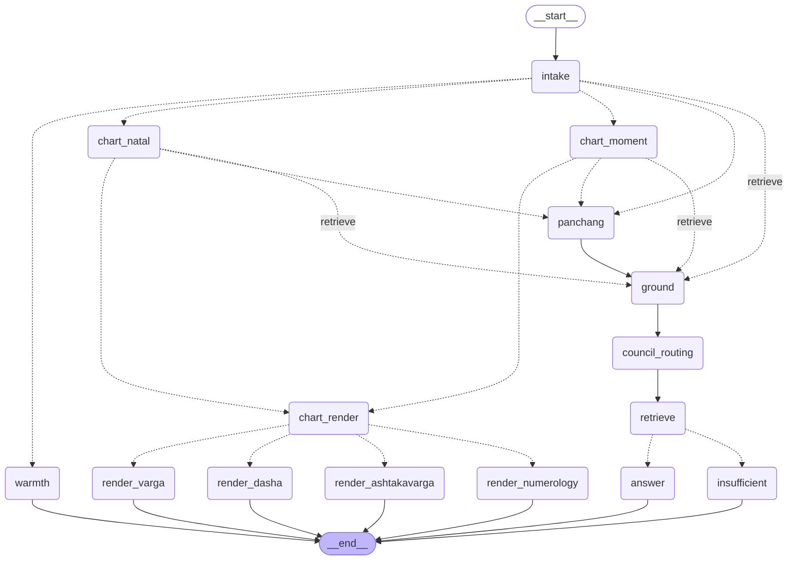

# The council graph

`council/orchestrator.py` was 564 lines with every branch inline. That made the
branches untestable: you could not ask *what happens to a muhurta question with
no birth data* without running chart computation, embeddings and two model
calls. So none of them were tested.

Here a **node does work** and an **edge chooses**. Every `route_*` function is
pure (`State -> str`) and has a table-driven test. That table is the first time
these branches have been tested at all.

Phase 1 is **behaviour-preserving**. Nothing about the astrology changed; only
where the control flow lives. `council_consult()` keeps its exact signature and
all 20 result keys, and is now 81 lines of adapter.

## Topology



Regenerate with:

```bash
./.venv/bin/python -c "
from rishivan.graph.build import build_graph
print(build_graph(store=None, client=None).get_graph().draw_mermaid())"
```

## Nodes and the state they own

Exactly one node writes each key. A test asserts each node returns only keys
from its own set — a node that returns the whole state defeats LangGraph's merge
and makes every write look like it came from everywhere.

| Node | Owns | Ported from |
|---|---|---|
| `intake` | `classification` `routing` `primary_rishi` `rishi_title` `query_domain` `search_query` | `council_consult:100-152` |
| `warmth` | `is_warmth` `outcome` `answer_stream` `primary_rishi` `rishi_title` | `:111-132` |
| `chart_natal` | `chart` `chart_summary` `chart_facts` `relevant_chart_tables` | `:156-194` |
| `chart_moment` | `chart` `chart_summary` `chart_facts` | `:214-236` |
| `panchang` | `panchang` `chart_facts` | `:199-212`, `:239-241` |
| `chart_render` | — (branch point only) | `:257` |
| `render_*` ×4 | `chart_table` `chart_table_error` | `:258-288` |
| `ground` | `nakshatra_now` `search_query` | `:296-360` |
| `council_routing` | `primary_rishi` `rishi_title` `life_domain` `routing` | `:363-390` |
| `retrieve` | `sources` `context_text` `matched_rules` `contributors` `chart_tokens` `rules_*` | `:392-535` |
| `answer` | `outcome` `answer_stream` | `:536-560` |
| `insufficient` | `outcome` `message` `answer_stream` | `:534` early return |

## Routers

| Router | Returns | The decision |
|---|---|---|
| `route_after_intake` | `warmth` · `chart_natal` · `chart_moment` · `panchang` · `retrieve` | Small talk first. Natal and moment charts are built from different inputs by different functions, so they are separate destinations. |
| `route_after_chart` | `chart_render` · `panchang` · `retrieve` | A display request short-circuits to a table and never reaches a model. |
| `route_chart_kind` | `render_varga` · `render_dasha` · `render_ashtakavarga` · `render_numerology` | One per kind. |
| `route_after_retrieval` | `answer` · `insufficient` | Pages **or** rules is enough. Neither means the corpus is silent, and saying so is the answer. |

## Two behaviours the plan got wrong, and the code settled

Both were caught by reading `council_consult` rather than trusting the plan:

- **There is no "ask for birth data" branch.** A natal question with no chart is
  rewritten to PRASHNA — the moment of asking becomes the chart. The rewrite is
  a state write, so it lives in `intake_node`, not a router. Numerology without
  a date is a `chart_table_error`, not a prompt for input.
- **The retrieval budget is `MAX_FACT_QUERIES=None, MAX_PAGES=20,
  MAX_MATCHED_RULES=10`.** The plan had invented 6/8/12, which would have
  quietly changed every answer.

## Known constraints

**Checkpointing is available but not wired in.** `answer_stream` is a live
generator and no checkpointer can serialise it — `graph.invoke` with a saver
raises, which `tests/graph/test_parity.py` pins deliberately. Phase 5 resolves
it by putting a serialisable `AnswerPlan` in state and moving narration outside
the graph. What a resumed conversation needs is the earlier turn's evidence, not
a half-consumed stream of its prose.

**`intent == "chart"` plus a panchang mention.** The orchestrator computes
panchang and then returns the table; the graph returns the table without
computing panchang. The visible answer is identical — only the unused `panchang`
result key differs on that path.

## What comes next

Phases 2–5 add nodes; they do not edit these. See
`docs/superpowers/specs/2026-08-25-chart-understanding-council-architecture.md`.

| Phase | Adds | Between |
|---|---|---|
| 2 | `chart_state` (§6) — planet- and house-level diagnosis | chart → ground |
| 3 | `varga_select` (§7), `dasha_windows` (§8) | chart_state → ground |
| 4 | `evidence_plan` (§12), eight Rishi nodes + `sakshi` (§11) | retrieve → answer |
| 5 | `answer_plan`, streaming critic, trace, prediction ledger | answer → end |

The state schema already carries `chart_state`, `vargas`, `timing`, `hierarchy`
and `reports` as `None`/`[]`, so each phase adds nodes rather than migrating
state.
