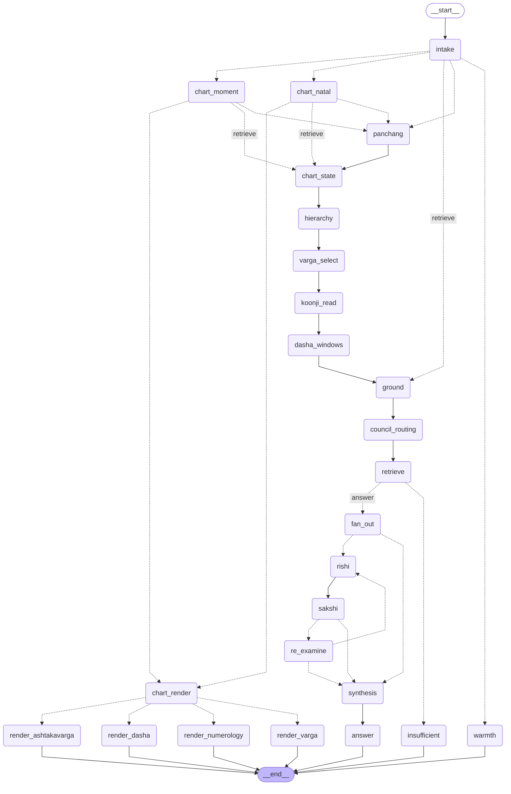

# The council graph

`council/orchestrator.py` was 564 lines with every branch inline. That made the
branches untestable: you could not ask *what happens to a muhurta question with
no birth data* without running chart computation, embeddings and two model
calls. So none of them were tested.

Here a **node does work** and an **edge chooses**. Every `route_*` function is
pure (`State -> str`) and has a table-driven test. That table is the first time
these branches have been tested at all.

Phase 1 is **behaviour-preserving**. Nothing about the astrology changed; only
where the control flow lives. `council_consult()` keeps its exact signature and
all 20 result keys, and is now 81 lines of adapter.

## Topology



Regenerate with:

```bash
./.venv/bin/python -c "
from rishivan.graph.build import build_graph
print(build_graph(store=None, client=None).get_graph().draw_mermaid())"
```

## Nodes and the state they own

One writer per key **per path**, and two deliberate sequential overwrites:
`panchang` prepends to `chart_facts` after a chart node sets it, and
`council_routing` overrides the `primary_rishi` that `intake` provisionally
picked. Both are last-write-wins on a single path and both match the original.
Nothing else is written twice — `intake` deliberately does not write `routing`,
which `council_routing` owns.

That distinction matters for Phase 4: a sequential overwrite is fine, a
concurrent one is not, so any key the Rishi fan-out writes needs a reducer.

**Every key a node returns must be declared in `RishivanState`.** LangGraph
discards writes to undeclared channels *silently* — no error, no warning. That
shipped once: `retrieve_node` returned `context_text`, the state did not declare
it, and every answer was generated with an empty context block while the sources
panel rendered normally. `test_integration.py` now walks the node modules and
checks every literal key they write against the schema.

| Node | Owns | Ported from |
|---|---|---|
| `chart_state` | `chart_state` `chart_digest` | new — blueprint §6 (Phase 2) |
| `varga_select` | `vargas` | new — blueprint §7 (Phase 3) |
| `dasha_windows` | `timing` | new — blueprint §8 (Phase 3) |
| `intake` | `classification` `primary_rishi` `rishi_title` `query_domain` `search_query` | `council_consult:100-152` |
| `warmth` | `is_warmth` `outcome` `answer_stream` `primary_rishi` `rishi_title` `query_domain` `routing` | `:111-132` |
| `chart_natal` | `chart` `chart_summary` `chart_facts` `relevant_chart_tables` | `:156-194` |
| `chart_moment` | `chart` `chart_summary` `chart_facts` | `:214-236` |
| `panchang` | `panchang` `chart_facts` | `:199-212`, `:239-241` |
| `chart_render` | — (branch point only) | `:257` |
| `render_*` ×4 | `chart_table` `chart_table_error` | `:258-288` |
| `ground` | `nakshatra_now` `search_query` | `:296-360` |
| `council_routing` | `primary_rishi` `rishi_title` `life_domain` `routing` | `:363-390` |
| `retrieve` | `sources` `context_text` `matched_rules` `contributors` `contributor_reports` `chart_tokens` `rules_*` | `:392-535` |
| `answer` | `outcome` `answer_stream` | `:536-560` |
| `insufficient` | `outcome` `message` (`answer_stream=None`) | `:531` early return |

## Routers

| Router | Returns | The decision |
|---|---|---|
| `route_after_intake` | `warmth` · `chart_natal` · `chart_moment` · `panchang` · `retrieve` | Small talk first. Natal and moment charts are built from different inputs by different functions, so they are separate destinations. |
| `route_after_chart` | `chart_render` · `panchang` · `retrieve` | A display request short-circuits to a table and never reaches a model. |
| `route_chart_kind` | `render_varga` · `render_dasha` · `render_ashtakavarga` · `render_numerology` | One per kind. |
| `route_after_retrieval` | `answer` · `insufficient` | Pages **or** rules is enough. Neither means the corpus is silent, and saying so is the answer. |

## Behaviours the plan got wrong, and the code settled

All caught by reading `council_consult` rather than trusting the plan:

- **There is no "ask for birth data" branch.** A natal question with no chart is
  rewritten to PRASHNA — the moment of asking becomes the chart. The rewrite is
  a state write, so it lives in `intake_node`, not a router. Numerology without
  a date is a `chart_table_error`, not a prompt for input.
- **The retrieval budget is `MAX_FACT_QUERIES=None, MAX_PAGES=20,
  MAX_MATCHED_RULES=10`.** The plan had invented 6/8/12, which would have
  quietly changed every answer.
- **`insufficient` returns no stream.** The plan had it stream a canned refusal;
  the original returns `answer_stream=None` and `streamlit_app` renders its own
  warning. Streaming the refusal would wrap it in a Rishi answer card, avatar and
  sign-off included — a plausible product change, and not a Phase 1 one.
- **`contributors` is two shapes, not one.** `prompts.contributor_context` reads
  attributes off `ContributorReport` objects; the result contract is a list of
  plain dicts. Collapsing them raised `AttributeError` on every chart reading
  that reached a live rule store.

## Known constraints

**Checkpointing is available but not wired in.** `answer_stream` is a live
generator and no checkpointer can serialise it — `graph.invoke` with a saver
raises, which `tests/graph/test_parity.py` pins deliberately. Phase 5 resolves
it by putting a serialisable `AnswerPlan` in state and moving narration outside
the graph. What a resumed conversation needs is the earlier turn's evidence, not
a half-consumed stream of its prose.

**`intent == "chart"` plus a panchang mention.** The orchestrator computes
panchang and then returns the table; the graph returns the table without
computing panchang. The table is identical, but `streamlit_app.py:417` renders a
panchang chip strip above the chart-table branch, so those chips do not appear
on that path. Rare combination, and worth fixing by routing `chart_render` after
`panchang` if it ever matters.

**`store` is a reserved parameter name.** LangGraph injects `config`, `store`,
`writer` and `runtime` into node callables *by name*, so a node with a `store`
parameter receives the framework's long-term-memory store rather than whatever
`functools.partial` bound. `retrieve_node` takes `vector_store` for that reason.

## What comes next

Phase 5 adds nodes; it does not edit these. See
`docs/superpowers/specs/2026-08-25-chart-understanding-council-architecture.md`.

| Phase | Adds | Between | State |
|---|---|---|---|
| ~~2~~ | ~~`chart_state` (§6)~~ | chart → ground | **done** |
| ~~3~~ | ~~`varga_select` (§7), `dasha_windows` (§8)~~ | chart_state → ground | **done** |
| ~~4~~ | ~~`hierarchy` + `koonji_read` (§12), the Rishi fan-out and `sakshi` (§11)~~ | chart_state → answer | **done** |
| 5 | `answer_plan`, streaming critic, trace, prediction ledger | answer → end | |

**The Phase 4 reordering is done.** The note that stood here said
`dasha_windows` could not produce a window until a Koonji reading established
the promise, and that retrieval ran after it. The resolution was neither of the
two options it proposed: the reading is not retrieval, and it does not need to
wait for retrieval. The chain is now

```
chart_state → hierarchy → varga_select → koonji_read → dasha_windows → ground → …
```

`hierarchy` settles the domain, `varga_select` picks the divisions, `koonji_read`
compiles facts with those divisions and fires the rules, and `dasha_windows`
times the promise that came out. Page retrieval still runs later and is
independent of all of it.

**Two things Phase 4 measured and did not fix, because neither is an
engineering problem:**

1. **Every one of the 1,117 rules is `status: candidate`.** None has been
   promoted. `Engine.read` defaults to production-only, so `koonji_read` states
   its status set explicitly (`nodes/koonji.SERVED_STATUSES`) and carries
   `reading_is_unreviewed` so the answer layer can say so. When a review pass
   runs, the flag goes false on its own.
2. **The corpus has no yoga-typed claims.** Claim ids fall in fifteen
   namespaces and none is `yoga.*`; nine rules mention a yoga in free text.
   `PlanetDiagnosis.yogas` therefore stays empty, alongside `functional_nature`,
   on the corpus-blocked list.
